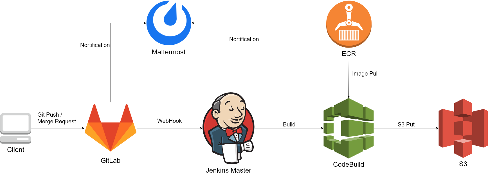

# jenkins-awscodebuild-starter

JenkinsとGitLabとMattermostとAWS CodeBuildを連携するサンプルプロジェクトです。

PushトリガーでAWS CodeBuildを実行し、`release/*` ブランチをpushした場合にのみ成果物をS3にPutします。



# Requirements

* Jenkins
* Jenkins Plugins
  * [GitLab Plugin](https://github.com/jenkinsci/gitlab-plugin)
  * [AWS CodeBuild Jenkins Plugin](https://github.com/awslabs/aws-codebuild-jenkins-plugin)
  * [Mattermost Nortification Plugin(Optional)](https://github.com/jenkinsci/mattermost-plugin)
* GitLab
* Mattermost(Optional)
* AWS CodeBuild Project
* AWS ECR

※連携をスムーズにするために、すべてAWSで動作していることを仮定します。

# Settings

## AWS CodeBuild

### AWS Conlose

AWS CodeBuildのプロジェクトをつくる。

* プロジェクト
  * プロジェクト名 : project name
* ソース
  * 現在のソース : GitLabのターゲットレポジトリ(GitHub Enterpriseを選択する)
* 環境
  * 現在のイメージ : ビルドに使うイメージを設定、ECRのイメージも選択可能
  * 現在のビルド仕様 : buildspec.ymlを使用
* アーティファクト ※実際は使わない
  * Amazon S3
  * バケット名 : 対象のバケット
* キャッシュ
  * タイプ : S3
  * バケット : 対象のバケット
  * パスのプレフィックス : 適宜設定
* サービスロール
  * アカウントでサービスロールを作成※
* VPC
  * 適宜設定

※サービスロールはArtifact用のS3へのアクセスとCloudWatch Logsにログ転送するロールが自動で払い出される

### buildspec.yml

To Doのところを適宜修正する。

```yml
version: 0.2

phases:
  install:
    # To Do
    commands: 
      - ./setup.sh
  build:
    # To Do
    commands:
      - ./build.sh
      - ./test.sh
  package:
    # To Do
    commands:
      - |
        if [ -z "${BRANCH_NAME%%release/*}" ]; then
          ./package.sh
        fi
  artifacts:
    # To Do
    commands:
      - |
        if [ -z "${BRANCH_NAME%%release/*}" ]; then
          aws s3 cp /path/to/artifacts "s3://path_to_artifacts_bucket/${BRANCH_NAME#release/}/artifacts" # To Do
        fi

cache:
  paths:
    - /path/to/cache/* # To Do
```

## Jenkins

### Jenkinsfile

`awsCodeBuild()`のTo Doのところを修正する。 

```groovy
    ...
    stages {
        stage('codebuild') {
            steps {
                awsCodeBuild(
                    credentialsType: 'keys',
                    projectName: 'projectName', // To Do
                    region: 'aws-region', // To Do
                    sourceControlType: 'project',
                    sourceVersion: env.BRANCH_NAME,
                    envVariables: "[{BRANCH_NAME,${env.BRANCH_NAME}}]",
                )
            }
        }
    ...
```

### Jenkins Configuration

Jenkinsの設定でノードの設定で同時実行数を適当な値に設定する。

# Links

* https://takamii.hatenablog.com/entry/2018/09/07/234509
* https://docs.aws.amazon.com/ja_jp/codebuild/latest/userguide/jenkins-plugin.html
* https://qiita.com/takamii228/items/3598f403518c296f93f3
* https://qiita.com/takamii228/items/a0f4b2ef8107d6d3cd34
